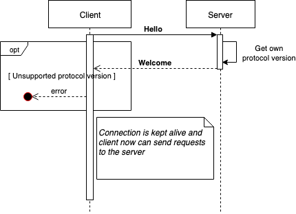
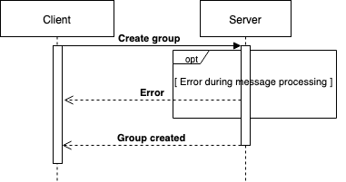
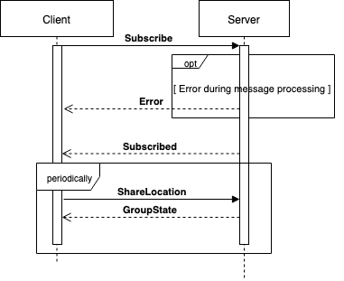

# 1. Table of content
<!-- TOC -->

- [1. Table of content](#1-table-of-content)
- [2. Overview](#2-overview)
- [3. Notations](#3-notations)
  - [3.1. Types](#31-types)
  - [3.2. Opcodes](#32-opcodes)
  - [3.3 Error codes](#33-error-codes)
- [4. Messages](#4-messages)
  - [4.1. Requests](#41-requests)
    - [Hello](#hello)
    - [4.1.1. Create group](#411-create-group)
    - [4.1.2. Subscribe](#412-subscribe)
    - [4.1.3. ShareLocation](#413-sharelocation)
  - [4.2. Responses](#42-responses)
    - [4.2.1. Welcome](#421-welcome)
    - [4.2.2. Subscribed](#422-subscribed)
    - [4.2.3. Error](#423-error)
    - [4.2.4. Group created](#424-group-created)
    - [4.2.5. GroupState](#425-groupstate)
- [Scenarios](#scenarios)
  - [Handshaking](#handshaking)
  - [Creating group](#creating-group)
  - [Subscribing to the group](#subscribing-to-the-group)

<!-- /TOC -->
# 2. Overview
The protocol is binary (big-endian) and follows request - response model. Once the command is received by the server, it is processed and reply is sent back to the client.

In order to achieve certain level of packet protection, the TLS protocol is used. TLS includes:
* Integrity protection (protected against modifications)
* Authentication (client is sure that it is connected to the genuine server)
* Confidentiality (traffic is encrypted)

In order to start the communication the client must establish TLS TCP connection with the server running on port `5432` and perform a handsaking procedure in order to ensure that both parties uses the same protocol version.

After handshaking is successfully completed, the client is allowed to send requests to the server.

Each message start with fixed size (5 byte) header. Where first byte is a message opcode and next 4 bytes - payload length.

# 3. Notations
## 3.1. Types
|        |        |
|--------|--------|
| byte   | A 8 bit integer |
| short  | A 16 bit integer |
| int    | A 4 byte integer |
| length | A 4 byte integer |
| double | A 8 byte floating-pont number |
| binary | A `length`, data pair, where size of the data is specified by length |
| string | A `byte` n, followed by n bytes. The maximal size is 255 characters |
| list of <type> | A `byte` n, followed by n <type> entries |
| image | `binary` , Supported format: .png , Max-length: 1Mb |
| member-location | A structure <user-id:int, lat: double, lon: double> |
| user-profile | A structure of <user-id: int, name: string, picture: binary> |

## 3.2. Opcodes
| Code | Message |
|--------|--------|
| 0x00 | Error |
| 0x01 | Hello |
| 0x02 | Welcome |
| 0x03 | Create group |
| 0x04 | Group created |
| 0x05 | Subscribe |
| 0x06 | Subscribed |
| 0x07 | Share Location |
| 0x08 | Group State |

## 3.3 Error codes
| Code | Description |
|------|-------------|
| 0x00 | Internal Error |
| 0x01 | Invalid Buffer Size |
| 0x02 | Invalid Data |
| 0x03 | Invalid Protocol Version |

# 4. Messages

## 4.1. Requests

### Hello

#### Description
The client sends welcome message with the actual protocol version.
Based on protocol version server may keep the connection. Or, if version is not supported by server, reply with an error and close the connection.

#### Payload
- Actual protocol version: `short`

#### Response
- Error
- Welcome

### 4.1.1. Create group

#### Description
The client must be able to create new group.

#### Payload
- Group name: `string`. Max-length: 32 characters

#### Response
- Group created
- Error

### 4.1.2. Subscribe

#### Description
Subscribes to the group.

#### Payload
- Invitation key: `string`
- User name: `string`. Max-length: 32 characters
- User picture: `image`

#### Response
- Subscribed
- Error

### 4.1.3. ShareLocation

#### Description
Shares own location and receive location of all group members as a response.

#### Payload
- Longitude: `double`
- Latitude: `double`

#### Response
- GroupState
- Error

## 4.2. Responses

### 4.2.1. Welcome

#### Description
Server inform client that the protocol version is supported and client can continue interaction with the server.

#### Payload
n/a

### 4.2.2. Subscribed

#### Description
Server notifies client about successful subscription and replies with the user id associated with subscribed client.

#### Payload
- User id: `int`

### 4.2.3. Error

#### Description
Informs the client about the error during request processing.

####  Payload
- Error Code: `byte`

### 4.2.4. Group created

#### Description
Server sends generated invitation key when new group has been successfully created.

#### Payload
- Invitation key: `string`

### 4.2.5. GroupState

#### Description
Profile list of newly joined group members and list of all member IDs

#### Payload
- NewMembers: `list of <user-profile>`
- Locations: `list of <member-location>`

# Scenarios

## Handshaking

## Creating group

## Subscribing to the group

